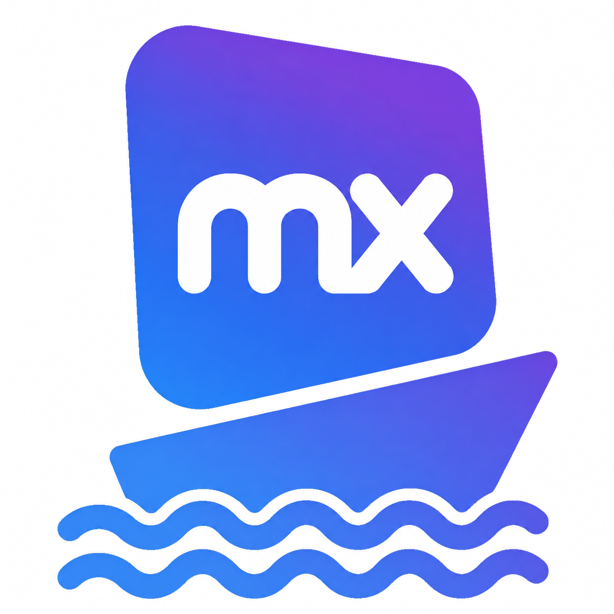

<p align="center">
  <a href="README.md">English</a> |
  <a href="README.ko.md">한국어</a> |
  <a href="README.ja.md">日本語</a>
</p>

<p align="center">
  
</p>

<h1 align="center">Mendimaru</h1>

Mendimaru は Mendix Studio Pro の各バージョンを検出・インストール・起動・削除する Tauri GUI アプリです。Windows ではネイティブに動作し、Linux では WinBoat を使用します。

## 画面構成

- **Studio Pro**: 現在の Windows 環境にある Studio Pro の検出・起動・インストール・安全な削除
- **プロジェクト**: 設定したワークスペース内の `.mpr` プロジェクトを検出・起動
- **設定**: Windows ネイティブワークスペースとポータブル Studio のパス、または Linux の WinBoat 環境を設定

ダッシュボード、VM リソース情報、高度なダウンロード URL、ビルド番号の手動入力は提供しません。

### 環境診断

設定画面では、WinBoat 実行ファイル、Compose 構造、コンテナーランタイム daemon、FreeRDP、共有ワークスペースとマウント、コンテナー状態、Guest API、loopback RDP ポート、Marketplace ブラウザーを個別に確認します。失敗した項目には、再検出、Windows の起動、WinBoat を開く、関連設定へ移動するなど、明示的で安全な次の操作のみを提示します。診断レポートは JSON としてコピーまたは書き出せます。許可された状態フィールドだけを含み、設定パス、資格情報、token、コマンド payload は除外します。

## Windows へのインストール

GitHub Release のアセットから MSI または NSIS セットアップをダウンロードします。Windows ビルドでは WinBoat、Docker、Guest API、RDP、FreeRDP、パス変換は不要です。

ネイティブ Windows モードでは次を行います。

- 32/64 ビットのアンインストールレジストリ、Mendix 標準フォルダー、Version Selector の情報、設定したカスタム／ポータブルパスから Studio Pro を検出
- `StudioPro.exe` を直接起動し、選択した `.mpr` パスをプロセス引数として渡す
- プロジェクトとインストーラーに Windows ネイティブパスのみを使用
- UAC を要求する前に、ダウンロードファイルの SHA-256 の安定性と Mendix／Siemens の信頼済み Authenticode 署名を検証
- 昇格したインストーラーまたは公式登録アンインストーラーの終了コードと実際の結果を確認
- 対象の `StudioPro.exe` が実行中なら削除を拒否し、公式削除情報がないポータブル版では削除を無効化

以前の設定は自動移行され、新しい `windowsStudioPaths` 一覧は既定で空のため、既存の Linux 設定もそのまま有効です。

## Arch Linux へのインストール

AUR から `mendimaru` パッケージをインストールします。

```bash
paru -S mendimaru
```

WinBoat は必須依存関係です。`winboat` 依存関係を満たすパッケージがない場合、
`paru` は AUR の `winboat` を自動的にインストールします。`winboat`、
`winboat-bin`、`winboat-electron`、`winboat-git` のいずれかがすでに
インストールされている場合は、そのパッケージをそのまま使用し、再インストール
しません。新しいシステムで別のパッケージを選ぶには、
`paru -S winboat-bin mendimaru` のように同じコマンドで指定できます。

Mendix Marketplace からインストール可能な Studio Pro バージョンを検索するには Chromium または Google Chrome も必要で、両方を任意のブラウザー依存関係として宣言しています。

## WinBoat の初期設定

WinBoat がインストール済みで Windows VM がまだ構成されていない場合、Mendimaru の **WinBoat セットアップを開始** ボタンから公式の WinBoat セットアップウィザードを開けます。Windows アカウント、VM リソース、Windows イメージ、Guest Server のインストールは WinBoat が処理します。

Mendimaru はウィザードが完了するまで状態を監視し、その後、次の作業を自動的に行います。

- AUR の `winboat-bin` が使用する `/opt/winboat/winboat` を含め、WinBoat の実行ファイルを検出
- `~/.winboat/docker-compose.yml` または `podman-compose.yml` を検出
- 実行中のコンテナから Guest API と RDP に動的に割り当てられた実際のホストポートを検出
- 設定した Linux ワークスペースを Compose ファイルの `/shared` マウントに適用
- 元の Compose ファイルを `*.mendimaru.bak` としてバックアップし、仮想ディスクを維持したままコンテナを一度再作成

初期設定をキャンセルした場合やウィンドウを閉じた場合は、**セットアップを続行** を選ぶと公式ウィザードを再度開けます。Mendimaru が Windows のユーザー名やパスワードを独自の設定にコピーすることはありません。

## 多言語対応

英語（`en-US`）、韓国語（`ko-KR`）、日本語（`ja-JP`）に対応しています。初期値にはシステム言語が使用されます。ヘッダーの言語メニューで選んだ言語はアプリ設定に保存され、次回の起動時にも使用されます。未対応のシステム言語では英語にフォールバックします。

翻訳とロケール依存の処理は Rust バックエンドが担当します。

- UI テキストとバックエンドのエラーメッセージは、`src-tauri/i18n/<locale>/mendimaru.ftl` の Fluent リソースで一元管理します。
- `i18n-embed` が翻訳リソースを実行ファイルに埋め込み、システム言語の選択と英語へのフォールバックを処理します。
- 日付、数値、ダウンロードサイズは、ICU4X でフォーマットしてからフロントエンドに渡します。
- フロントエンドはバックエンドから渡された翻訳バンドルを表示し、翻訳された文言から状態を判定しません。ダウンロードのキャンセルなど、動作に影響する値は個別のコードと状態として渡されます。
- テストでは、全言語の翻訳キーと変数の構成が一致すること、および React が使用する静的な翻訳キーがすべてバックエンドのバンドルに含まれることを確認します。

言語を追加するには、`src-tauri/src/i18n.rs` の対応ロケール一覧に BCP 47 言語タグと表示名を登録し、英語ファイルと同じキーおよび変数を持つ Fluent ファイルを `src-tauri/i18n/<locale>/mendimaru.ftl` に追加します。新しい UI テキストは 3 つの Fluent ファイルと `src/shared/contracts/uiMessages.json` に追加してください。このレジストリは TypeScript の翻訳キー型と Rust の UI バンドルの両方で使用され、`cargo test` により翻訳の欠落や変数の不一致を検出できます。

## Studio Pro バージョンの検索とインストール

`kirakiraichigo-mendix-manager` と同じ方法で、[Mendix Marketplace の Studio Pro ページ](https://marketplace.mendix.com/link/studiopro)にあるデータグリッドを Chromium で読み取ります。

- 最初の 10 バージョンを自動的に更新し、**以前のバージョンをさらに読み込む** を選ぶと次のページを取得します。
- 一覧をアプリのキャッシュディレクトリにある `studio-version-catalog.json` に保存し、次回起動時に先に表示します。
- リリース日とともに Latest、LTS、MTS、Beta のラベルを取得します。
- Studio Pro 11 以降では公式の `Mendix-<version>-Setup.exe` アーティファクトを使用します。
- Studio Pro 10 以前では、バージョン詳細ページから `Build <number>` を自動的に抽出し、`Mendix-<version>.<build>-Setup.exe` を使用します。
- 一覧からバージョンを選ぶだけでよく、URL やビルド番号を入力する必要はありません。
- ダウンロード済みインストーラーは、記録された配布元、想定サイズ、Windows PE 構造、SHA-256 がすべて一致する場合にのみ再利用します。メタデータのない旧キャッシュや変更されたキャッシュは削除して再ダウンロードします。
- 未インストールの各カタログバージョンには、既存キャッシュを再利用せずインストール失敗から復旧するための強制再ダウンロード操作があります。

Windows ではシステムおよびユーザーの標準場所にある Microsoft Edge と Chrome を検出します。Linux では `MENDIMARU_CHROME_PATH`、`google-chrome-stable`、`google-chrome`、`chromium`、`chromium-browser` の順に検出します。

## Windows のパス

レジストリと Version Selector の情報に加えて、次の既定場所も検出します。

| 用途 | Windows パス |
| --- | --- |
| Studio Pro のインストールルート | `C:\Program Files\Mendix` |
| Studio Pro の実行ファイル | `C:\Program Files\Mendix\<version>\modeler\studiopro.exe` |
| Studio Pro のアンインストール情報 | `C:\ProgramData\Mendix` |
| ネイティブの既定ワークスペース | 存在する場合は `%USERPROFILE%\Mendix`、それ以外は `%USERPROFILE%` |
| Linux WinBoat の共有パス | `\\host.lan\Data` |

インストーラーは設定したワークスペース内の `.mendimaru/installers` に保存されます。ネイティブモードでは署名を検証し、コマンドシェルを使わず Windows の昇格 API で起動します。Linux モードでは UTF-16LE でエンコードした PowerShell コマンドを WinBoat RemoteApp に渡します。プロセスが正常終了し、対象バージョンの `StudioPro.exe` が検出されて初めて完了と判定します。

削除についても同様に、Windows のアンインストーラーが終了し、対象バージョンの `StudioPro.exe` がなくなったことを確認した後、インストール済みバージョンの一覧を自動的に更新します。

Linux WinBoat モードでは、Studio Pro の起動ボタンは Windows プロセスが実際のウィンドウを作成し、FreeRDP が表示できる状態になるまで無効のままです。起動準備中は、重複起動を防ぐため、ほかのバージョンやプロジェクトの起動ボタンもロックされます。Windows は共有操作スクリプトのハッシュを固定し、一意の専用パスへコピーしてそのコピーだけを実行します。インストールと削除は、すでに管理者権限を持つ WinBoat セッションのトークンを継承するため、別の UAC ウィンドウは表示されません。

## Linux 共有ワークスペース

Linux 共有ディレクトリは、WinBoat の Compose ファイルにある `<host path>:/shared` マウントに接続されます。プロジェクト一覧はこのディレクトリだけを走査し、`.git`、`node_modules`、`deployment`、`.mendix-cache`、`.mendimaru` などの生成ディレクトリやキャッシュディレクトリを除外します。

共有ディレクトリを変更すると、既存の Compose ファイルを `*.mendimaru.bak` としてバックアップします。設定画面で変更をすぐに適用するよう選択すると、`/storage` 仮想ディスクとインストール済みの Windows アプリを維持したまま WinBoat コンテナを再作成します。

## Backend capability contract

エージェントと CI は GUI を起動せずに、プラットフォーム中立の backend contract を確認できます。

```bash
mendimaru capabilities --json
```

応答は host、Studio、任意の Runtime platform を区別し、Studio、Runtime、UI automation、browser の全操作を supported または unsupported として報告します。明示的な `--backend` は現在の host と一致する必要があり、別の backend へ暗黙に fallback しません。詳細は [Platform backend and capability contract](docs/backend-contract.md) と機械可読な [JSON Schemas](schemas/) を参照してください。

## 開発

開発には Node.js 22.22.2 以降、Rust、ホスト向け Tauri システム依存パッケージが必要です。Linux 統合には WinBoat、Docker または Podman、FreeRDP 3、Chrome／Chromium が追加で必要で、Windows の一覧取得には Edge または Chrome を使用します。

```bash
npm install
npm run tauri dev
```

プロジェクトの検証とアプリバンドルの生成：

```bash
npm run check
npm run tauri build
```

`npm run test:e2e` は OS 境界をモックした Windows ネイティブのアプリ全体フローを実行します。Rust の全テストではレジストリ解析、パス隔離、ファイル整合性、Windows 引数のエンコード、UAC／終了コードの失敗、インストールから削除までの fixture ライフサイクルを検証します。CI は Windows と Linux の両方でテストし、Windows の MSI／NSIS バンドルをスモークビルドします。

Rust と TypeScript で共有するシリアライズ済み enum 値は `src/shared/contracts/enumValues.json` で管理します。TypeScript はこのレジストリから union 型を導出し、Rust テストが契約のずれを検出します。

実際の Marketplace と連携するテストは、既定のテスト実行から除外されています。次のコマンドで実行できます。

```bash
cd src-tauri
cargo test marketplace::tests::live_ -- --ignored --nocapture
```

## セキュリティ

Windows ネイティブのコマンドはパスをコマンドシェルへ挿入しません。インストーラー、インストール済みの Studio 実行ファイル、および登録済みの Mendix アンインストーラーには、Mendix または Siemens が発行した有効で信頼済みの Authenticode 署名が必要で、検証前後のハッシュによりファイル置換も検出します。Windows Installer による削除は製品コードへの `/x` 操作と既知の非対話フラグに限定し、登録アンインストーラーは選択したインストールに属し、許可リスト内のフラグだけを使用する必要があります。UAC のキャンセルや失敗終了コードを成功として扱いません。

Linux では Windows のユーザー名とパスワードをアプリ設定に保存しません。RemoteApp 起動時に実行中の WinBoat コンテナから認証情報を読み、FreeRDP 3 の標準入力へ渡します。FreeRDP はアプリ専用の TOFU 証明書ピンを使い、管理者権限の操作は Guest API と RDP がループバックだけにバインドされている場合に限定します。共有操作結果は試行ごとの HMAC キーとリプレイ防止シーケンスで認証します。

脅威モデル、実行ファイルの信頼チェーン、コンテナ権限と残存リスク、報告方法については、[セキュリティポリシーと WinBoat 信頼境界](SECURITY.md)を参照してください。

## ライセンス

Mendimaru は [MIT ライセンス](LICENSE)の下で提供されます。
