# Studio Pro UI automation — Linux + WinBoat (#16)

**Linux + WinBoat investigation complete.** Decision: **Limited Go** for a
bounded Windows helper, with the frozen unattended flow **not ready for product
use**. Native Windows is deferred at the user's request; #16 remains open for
that transport. This spike does not enable product UI capabilities.
[Earlier checkpoints](winboat-studio-uia/history.md) are historical, including the
resolved reboot and guest reservation blockers.

## Environment and fixtures

| Item                 | Measured configuration                                             |
| -------------------- | ------------------------------------------------------------------ |
| Host                 | Linux `7.2.6-arch2-1`, dedicated X11 display, 1280×800             |
| Transport            | WinBoat, FreeRDP `3.31.1 (63b948ca5c)`, same interactive session 2 |
| Guest                | Windows 11 Pro, build 26100; Windows PowerShell 5.1.26100.4202     |
| Studio file versions | **10.24.26.0**, **11.12.4.0**                                      |
| Studio presentation  | English (United States), Light, 100% / 96 DPI baseline             |
| Candidates           | .NET Framework UIA; FlaUI UIA3 5.0.0; winappCli 0.6.0              |
| Projects             | Disposable local Blank Web App and a separately converted copy     |

Exact candidate bytes are pinned in
[`candidates.json`](../scripts/spikes/studio-uia/candidates.json). Discovery must
use the running container's port mappings; persisted RDP/API ports differed.
No original product project was opened or converted. The Studio 10 baseline MPR
SHA-256 is `489c356920d21e577ba7c6b696a33191da2fc9945722aef23e5f90305c9cc89a`;
it was verified unchanged after converting the separate Studio 11 copy. Preserve
`UIA16_10.mpr` as the basename in both directories: renaming only the v2 MPR
caused an opening failure because `mprcontents` still referenced that basename.
PID, start time, executable path and exact file version distinguish the apps.
The independently described Studio 11 baseline also contains `uia16Probe`; its
MPR SHA-256 is `f03e6cf616a567dd1d3c17f29ed5bc3fe339e8f76382442dd8ab2212f6fc1932`.

## Pilot compatibility findings

These findings describe this fixture and the exact versions above. They are not
a guarantee for all widgets, properties, layouts or future Studio releases.

| Area/action             | 10.24.26.0                                 | 11.12.4.0                                | Locator/effect requirement                                                                   |
| ----------------------- | ------------------------------------------ | ---------------------------------------- | -------------------------------------------------------------------------------------------- |
| App Explorer            | Native WPF tree                            | Native WPF tree                          | `DataItem`, document name; disambiguate by module                                            |
| Open page               | Ctrl+G, Go To modal                        | Same                                     | Native File-menu focus; unique modal search editor; verify page document                     |
| Design preview          | Chrome document `MyFirstModule.Home_Web`   | Same                                     | Scope text lookup to page document; intersect bounds with its viewport                       |
| Select demo text widget | Semantic text lookup + UIA-derived click   | Same                                     | Verify selected widget's Properties Name                                                     |
| Properties Name         | Unnamed ValuePattern editor under Name row | Parent/child Name labels both exposed    | Scope to Properties, resolve row editors, deduplicate by full runtime ID                     |
| Commit property         | SetValue, focus, Tab, reacquire            | Same                                     | Read back new value; save; old element/runtime slug may be stale                             |
| Structure               | WPF toolbar / WinForms canvas              | WPF toolbar / WinForms canvas            | Verify WPF Design-mode button after transition; generic canvas children remain limited       |
| Design                  | Invoke mode button                         | Same                                     | Verify Chrome page document after transition                                                 |
| Toolbox search          | `Search...`, `DataItem` Rating             | `Search…`, `ListItem` Rating             | Version-specific locator, scoped to Toolbox tab                                              |
| F4                      | Native-focus keyboard fallback             | Same                                     | Remove unused Rating MPK, verify disappearance, restore identical bytes, verify reappearance |
| Run Locally             | Native-focus F5                            | Same                                     | HTTP 200 plus port ownership by fixture-specific Studio child runtime                        |
| Stop runtime            | Console Stop InvokePattern                 | Same                                     | Verify that owned runtime process exits                                                      |
| Consistency errors      | Readable native rows, 10 → 0 errors        | Same                                     | Remove/restore used Data grid 2 MPK; rows are virtualized                                    |
| Dialogs                 | Go To/preferences available                | Sign In Later/conversion/Go To available | Resolve a known dialog before resuming; never dismiss an unknown dialog blindly              |

The final saved models were copied with stable source hashes and independently
described with mxcli: Studio 10 `uia16T10_19`, Studio 11 `uia16T11_20`.
These are the last successful Name writes, including writes before a later failed
step; the failed whole-flow results remain failures.
FlaUI UIA3 also changed the Studio 11 Name, and .NET UIA independently read back
and verified its restoration. Plain winapp selectors can return duplicate matches
for one popup runtime ID; generic ancestor Invoke may target an unintended
container. Input delivery or exit code zero is insufficient proof.

The frozen runner uses the native File menu for Ctrl+G/F4/F5 focus. Studio 10
pilots also used the native Properties Name editor for F4/F5 focus. Initial shortcuts
sent with WebView focus had no verified effect. F4 sometimes left RemoteApp's
marker window foreground; the input guard rejected this until native focus was
reacquired. Name labels, page names and text snippets alone are not global keys.

## Capture and session boundaries

| Probe                              | Observation                                                                                                    | Consequence                                                                                                |
| ---------------------------------- | -------------------------------------------------------------------------------------------------------------- | ---------------------------------------------------------------------------------------------------------- |
| Raw UIA depth                      | Depth 18 missed WebView nodes; depth 48 reached depth 40 in Studio 10                                          | Bound depth, nodes and wall time; report truncation explicitly                                             |
| .NET/FlaUI                         | Both captured 982 nodes without truncation on a later Studio 10 screen                                         | Both can expose the relevant page/property state; timings were not controlled speed comparisons            |
| Studio 11                          | A later matched baseline capture produced 802 nodes with both .NET UIA and FlaUI, without truncation           | Matching coverage for this state; instrumentation and host load were not controlled for speed ranking      |
| Windows PrintWindow                | Rendered Design/WebView in both versions                                                                       | Review pixels; a true API return alone is not a usable-image guarantee                                     |
| winapp WGC                         | Rendered main and owned windows                                                                                | Its multi-window image is a side-by-side composite, not actual screen occlusion                            |
| Linux notification, compositor off | Transparent notification area became a black rectangle over Properties                                         | Linux pixels can obscure a UIA-accessible region                                                           |
| Minimize/restore pilot (10)        | Windows captures rendered while Linux output became blank; reconnect recovered it                              | Preserve native window state and transport state separately; cause not isolated                            |
| Reconnect pilot (11)               | UIA and Windows captures worked while Linux stayed white; normal/maximize and compositor-on did not recover it | Fresh Studio process restored Linux rendering; reconnect alone is insufficient evidence of a usable screen |
| Lock (10)                          | Default input desktop unavailable; collector rejected; winapp input returned `no_interactive_desktop`          | Fail closed; no lock-screen input fallback                                                                 |
| Reconnect (10)                     | Same Studio PID/start ticks and session survived                                                               | Revalidate identity and reacquire UIA elements                                                             |
| 125% (10)                          | Monitor/helper 120 DPI, running Studio still 96 DPI; property readback and both modes passed                   | Record monitor scale, system DPI and target DPI; use per-monitor-aware physical bounds                     |
| Stale identity                     | Live collector rejected wrong start ticks                                                                      | Do not attach by PID alone                                                                                 |
| Five-second capture budget         | Supervisor rejected timeout and reported worker exited                                                         | Isolate provider calls in a killable MTA child; retain partial evidence                                    |

The isolated FreeRDP client also exited with `ERRINFO_LOGOFF_BY_USER` during
pilots. Its cause was not attributed to another task. The dedicated display's
screensaver was disabled; this did not repair an existing blank surface.
Compositor-on notification behavior was not isolated in a separate probe. These are
Linux/WinBoat observations, **not native Windows measurements**.

## Representative results

Twenty actual trials per exact version used the same frozen harness. Trials 1,
6, 11 and 16 started a fresh Studio process; the other 16 retained it. “Cold”
means Studio process cold, with existing VM, OS and build caches. Each flow opens
Home_Web, selects its body text, changes and saves a unique Name with readback,
changes to Structure and Design, verifies F4 removal/restoration, then starts and
stops its own runtime. All seven effects and runtime cleanup are required to pass.
HTTP 200 plus the owned JVM/listener verifies the server, not browser rendering.

The [protocol](winboat-studio-uia/protocol.json) fixes the harness hash, environment
and fixture baselines before trial 1. The [ledger](winboat-studio-uia/ledger.json),
[summary](winboat-studio-uia/summary.json) and
[observations](winboat-studio-uia/observations.json) retain all 40 attempts and the
source hashes for their proofs. Failures were not replaced with successful retries.

| Studio file version | Overall         | Cold | Warm  |
| ------------------- | --------------- | ---- | ----- |
| 10.24.26.0          | **1/20 (5%)**   | 0/4  | 1/16  |
| 11.12.4.0           | **17/20 (85%)** | 2/4  | 15/16 |

| Version    | Failed trial IDs          | Step             | Observed failure                |
| ---------- | ------------------------- | ---------------- | ------------------------------- |
| 10.24.26.0 | 1, 5, 11, 12, 16, 17      | `open-page`      | `page-editor-control-not-ready` |
| 10.24.26.0 | 2, 6, 14, 19              | `structure-mode` | `page-editor-control-not-ready` |
| 10.24.26.0 | 3, 4, 7, 8, 9, 10, 15, 20 | `select-widget`  | `wrong-widget-selected`         |
| 10.24.26.0 | 18                        | `synchronize-f4` | `toolbox-search-not-ready`      |
| 11.12.4.0  | 1                         | `synchronize-f4` | `toolbox-search-not-ready`      |
| 11.12.4.0  | 6, 8                      | `open-page`      | `page-editor-control-not-ready` |

A failed step stops that attempt; downstream steps stay `not-run`. These are
whole-flow rates for this fixture, inherited per-version UI layout and harness,
not UIA capability ceilings or a causal ranking of Studio versions. Read-only
reviews between failed attempts are retained separately and do not change scores.
No live readiness fixes were inserted into the frozen measured script.

Both versions exposed one-shot readiness gaps around the Design button and
the initial Toolbox search. The expected controls appeared on
later inspection. Studio 10 additionally outlined the preview text while
Properties reported page Name `Home_Web`; later readback still returned the page
Name. This mismatch is not demonstrated proof of a delayed property update.

Host load was not isolated from other repository verification VMs. Durations in
the observations include polling, UI inspection/capture and, on cold requests,
Studio launch. They are operational observations, not candidate speed benchmarks.

## State model and minimum command draft

```mermaid
stateDiagram-v2
  [*] --> Unbound
  Unbound --> Ready: exact process / active session / Default desktop
  Ready --> Busy: command starts
  Busy --> Ready: effect and cleanup verified
  Busy --> KnownDialog: owned modal
  KnownDialog --> Ready: explicit supported resolution
  Ready --> Unavailable: lock / disconnect / stale identity
  Busy --> Unavailable: timeout / lost foreground / occlusion
  Unavailable --> Unbound: reconnect or relaunch; discard element handles
```

A future Windows helper should expose the following bounded commands, with a
common identity envelope (PID, UTC start ticks, executable path/version, session
and window generation), timeout, cancellation and structured failure reason:

- **Bind/status**: verify the exact process and interactive desktop; enumerate
  owned windows/dialogs and report minimized, foreground and DPI state.
- **Inspect**: bounded raw tree with parent IDs, relevant pattern state and
  explicit truncation; omit password values. A partial tree is not absence proof.
- **Capture**: record method, window/monitor bounds and state, return a private
  artifact requiring review; distinguish window composites from screen capture.
- **Invoke/read/set**: resolve one scoped element, require its actual pattern,
  reject unsupported/read-only/stale targets, reacquire after changes and verify
  the app effect. Initial write scope should be the demonstrated Name editor.
- **Keyboard fallback**: require known native focus, foreground ownership,
  active desktop and an explicit effect verifier for the supported shortcut.
- **Cancel/release**: stop the owned helper child and free UIA/GDI resources;
  preserve results and never terminate an unrelated Studio/runtime process.

Transport connection ownership, reconnect, Linux window mapping and Linux
capture belong to the Linux transport. A product implementation must integrate
[shared VM use](winboat-vm-use.md) and subsequent UI arbitration; this private
external lab does not automatically participate in application VM leases. UIA tree/action logic and Windows capture
belong to the Windows helper. The latter sharing is a design proposal until the
native Windows transport is measured.

## Decision and follow-up scope

**Limited Go for a bounded Windows helper; No-Go for shipping the frozen runner
as an unattended default.** Tree inspection, Windows capture and the demonstrated
semantic commands justify the helper work in #21. The representative failures
prevent claiming a reliable general Studio automation flow. Generic canvas
editing, arbitrary widgets/properties and a default image-driven action loop
remain unproven.

**Fixed coordinates are not the default.** A click derived from a unique semantic
element is conditional on fresh bounds, viewport/screen intersection, visibility,
foreground/window ownership and effect readback. Preview highlighting alone does
not prove that Properties describes the intended widget. Unsupported targets
must return a structured failure rather than continuing with guessed input.

The next provider implementation should:

1. Start with bounded inspect/capture and exact process/session ownership.
2. Pin the demonstrated locators to the exact Studio versions and scope them to
   the document, panel or owned modal; reacquire elements after changes.
3. Poll for explicit document, mode and panel readiness within the command's
   deadline, replacing the frozen runner's one-shot readiness assumptions.
4. Verify selected widget and property state together before a write, then verify
   readback and save. Diagnose the Studio 10 mismatch before enabling that flow.
5. Preserve Windows capture and Linux transport visibility as separate evidence;
   integrate cancellation, reconnect invalidation and UI input arbitration.
6. Run a new, separately identified repeated campaign before enabling product
   capabilities. The current failures remain immutable evidence.

Native Windows interactive Studio validation stays deferred in #16. Repository
CI on Windows checks the application and bundle; it does not supply the missing
native Studio UI automation measurements.

## Evidence and validation

[Reviewed screenshot examples](winboat-studio-uia/artifacts.json) identify their
pilot or campaign phase. [UI tree excerpts](winboat-studio-uia/tree-examples.json)
retain selected original nodes and their ancestry, with raw source hashes.
[Structure excerpts](winboat-studio-uia/structure-tree-examples.json) expose the
WPF toolbar and WinForms canvas/scrollbars; their viewport has no widget children.
[Capture review](winboat-studio-uia/capture-review.json) covers 98 tree captures.
Studio 10 trial 6's property capture contains only a save Progress dialog, so
that tree does not prove the property value. The frozen flow read the Name before
save, and trial 13 read the same `uia16T10_06` after a fresh Studio launch. The
coverage gap remains explicit; successful capture exit alone is insufficient.
Private raw requests, trees, captures and failures remain in the dedicated
`issue-16/live-20260915` lab. The disposable experimental bridge had serialization,
sequence, child-timeout and command-line-length defects; these failed attempts
are retained and excluded from representative counts. The bridge is not a
product provider. Long signed requests now execute from the private guest NTFS
lab instead of exceeding Windows' command-line limit.

The experimental collector is under
[`scripts/spikes/studio-uia`](../scripts/spikes/studio-uia/). It writes to a new,
private local NTFS directory and rejects UNC, linked ancestors and reused
outputs. Only reviewed artifacts should be copied out. `evidence.mjs` checks
ledger consistency, not whether a screenshot proves an assertion.

## Cleanup and checks

[Supplemental validation](winboat-studio-uia/validation.json) records independent
saved-model reads, collector boundaries and cleanup. Studio 10 was restored to
Korean/Auto. Studio 11 was restored to Korean/Dark: Dark is an **inference** from
the original Auto and Light radios both being unselected; the optional user
clarification was unanswered. Selection readback and preference save succeeded.
Both fixture Studios and all fixture runtimes exited, and both Rating packages
match their original hash. The private guest agent, dedicated FreeRDP client,
xfwm4 and Xvfb exited. The VM and private evidence were retained.

Validation completed:

- All 40 attempts satisfy the ledger schema and frozen protocol identity; source
  hashes, screenshots and the 98 captured trees were reviewed with the one
  explicitly documented capture coverage gap.
- Eight Node tests passed for candidate verification, failure accounting and
  ledger checks; all five candidate downloads matched their pinned bytes.
- Changed PowerShell tools parsed successfully; live collector checks rejected
  stale identity and five-second timeouts, with child exit confirmed. The final
  collector cleanup-race fix also passed normal/stale/timeout checks in Studio 11.
- JavaScript lint and changed-file formatting checks passed. Product lifecycle,
  runtime schema and capability code are outside this change.

Native Windows Studio validation remains the unresolved part of #16.

## Studio 10 Rspack selection (2026-09-21)

Follow-up lab work on the #21 Linux+WinBoat track completed the Studio 10
web-client build that previously died in `rollup-runner.mjs` (exit 134).
Findings below describe the disposable `UIA21_10_RSPACK2_20260921` fixture and
Studio Pro `10.24.26.123458`; they extend the product conclusions above, not
the fixture claims.

- Decoding the `Settings$ProjectSettings` unit (`Forms$WebUIProjectSettingsPart`
  BSON in `mprcontents/4e/70/4e70063d-*.mxunit`) shows Studio 11 adding
  `EnableNewStringBehavior` and `EnableRspackBundler` over Studio 10. Selecting
  Rspack on 10.24.26 required both a project-level `EnableRspackBundler: true`
  setting and an `app-bundler` file (exact bytes `rspack`) at the project root;
  either alone kept Rollup. Studio 11 needed only the setting. The `.mpr` unit
  `ContentsHash` is not enforced for local projects, but edits belong on
  disposable copies, never the preserved fixtures.
- With both switches set, 10.24.26 selected Rspack but its
  `modeler/tools/node/rspack-runner.mjs` failed on UNC projects with
  `ERR_INVALID_FILE_URL_PATH`: it imports the config via
  `"file://" + deploymentWebDirectory + ...`, producing `file:////host.lan/...`.
  11.12.4 fixed this upstream with `pathToFileURL(nodePath.join(...))`. The lab
  applied the same two-line fix to the guest's runner copy (original preserved
  and hashed). This is a disposable-VM workaround, not product behavior — the
  same standing caveat as the fixture-only `deployment/gradle.properties`
  VFS note.
- Full flow then passed on Linux+WinBoat: Go To `Home_Web`, project-ready, F5,
  `Build started (Rspack)` (11 s), observed `running`, HTTP 200 on the forwarded
  port, and a sandboxed headed Linux Chrome assertion of
  `.mx-name-uia21Probe10` with no request interception, zero failed/HTTP/
  console/page errors and no `host.lan` request. `assets watch
--rewrite-generated-assets` normalized the generated widget imports (24
  files, 64 imports) that otherwise referenced `http://host.lan/...` URLs.
- Two product robustness fixes came out of the same session and live on the
  branch: v4 operation-history records (`schemaVersion 4.0.0`) are readable
  again, and the UI supervisor request window tolerates bounded host/guest
  clock differences (`ui_supervisor.ps1`, see
  [clock sync](winboat-clock-sync.md)).
